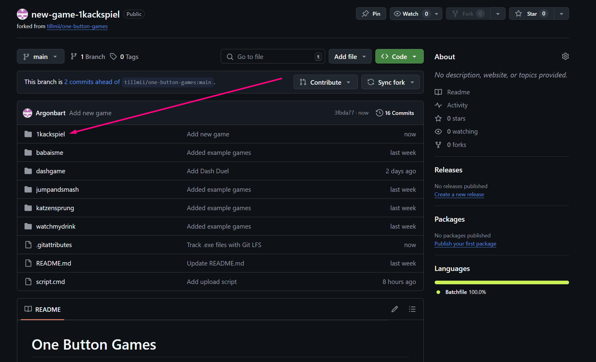

# One Button Games
This repository holds all one button games for the one button arcade machine.  
If you want to contribute a game, submit a pull request or talk to us directly.  

## Submission
You should add only one folder for your game.  
That folder should contain:  
- An executable to play your game. It should be named **game.exe**!
- An image to display your game. It should be named **image.jpg**!  
- A README file with some additional infos structured as below. It should be named **README.md**!

### Structure for the README
The README file should be structured as follows:
- First line should start with a **#** and follow with the title of the game (e.g. *# My Great Game*)  
- Second line should contain the description of the game.  

#### Example README
```
# My Great Game
In "My Great Game" you play my great game! :)
```

## How to Submit

### Short version (if you know how git works)
Fork the project, add your submission and submit a pull request.

### Long version (if you are unsure how to use git)

#### Step 0: Install Git
You need Git installed to clone and push files to the repository.  
Download here: [Link](https://git-scm.com/downloads)

#### Step 1: Fork the project
Press the button at the top to fork this project.  


Name the forked repository and create it.  


#### Step 2: Clone the project
In your forked repository, click the "Code" button.  


Then copy the HTTPS (or SSH) clone link.  


Find the "clone" button in your git user interface.  


Clone the project by inserting the clone link.  
You can also assign a location the repository should be created at.  


#### Step 3: Copy your game
Insert your folder into your local repository.  
The folder should contain three files: "game.exe", "image.jpg", "README.md".  


#### Step 4: Execute script
Execute the "script.cmd" file.  
Do not press anything until the script is finished.  
If everything worked correctly, your folder should be visible in your online forked repository from step 1.  


#### Step 5: Submit a pull request
Finally open a pull request on the webpage by clicking the button at the top.  
